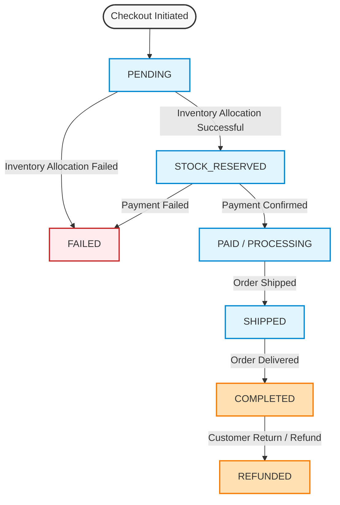

# E-shop
Backend for an E-shop implemented in [Kotlin](https://kotlinlang.org/), [Spring Boot](https://spring.io/projects/spring-boot), [Spring Data JDBC](https://spring.io/projects/spring-data-jdbc), [Spring Modulith](https://spring.io/projects/spring-modulith), [Spring Security](https://spring.io/projects/spring-security) and [Postgres](https://www.postgresql.org/). 

TODO pwestlin: Doc modules

TODO pwestlin: Fixa flödet nedan så den stämmer med koden.
