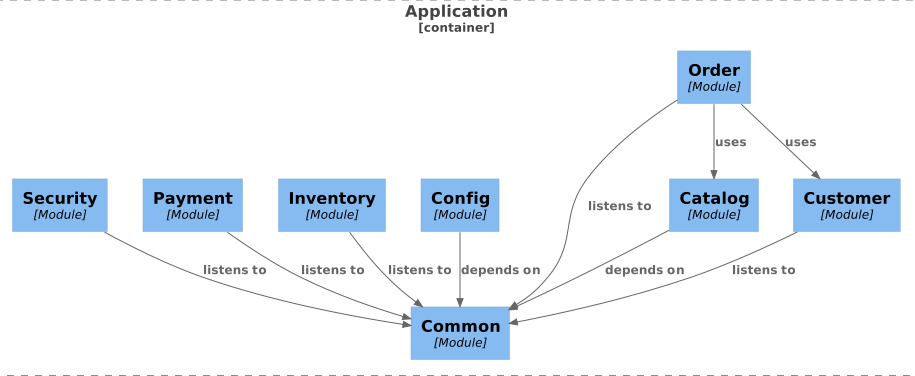
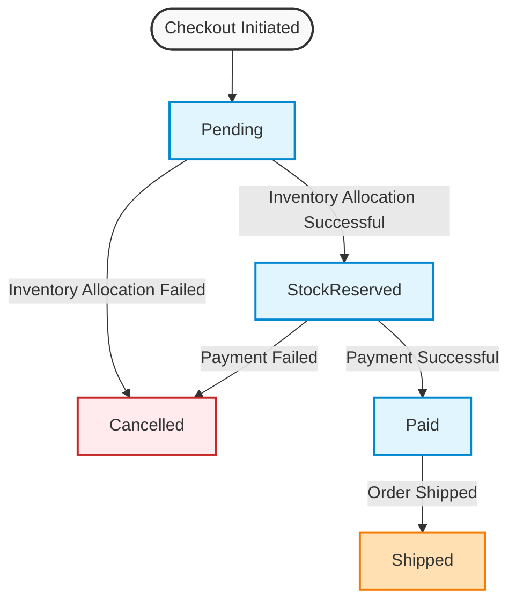

# E-shop

Backend for an E-shop implemented
in [Kotlin](https://kotlinlang.org/), [Spring Boot](https://spring.io/projects/spring-boot), [Spring Data JDBC](https://spring.io/projects/spring-data-jdbc), [Spring Modulith](https://spring.io/projects/spring-modulith), [Spring Security](https://spring.io/projects/spring-security)
and [Postgres](https://www.postgresql.org/).

For testing it
uses [Spring Modulith test](https://docs.spring.io/spring-modulith/reference/testing.html), [JUnit](https://junit.org/), [AssertJ](https://assertj.github.io/doc/)
and [Testcontainers](https://testcontainers.com/).

## Architecture

Modular Monolith and Event-Driven Architecture (EDA).  
Yes, I did cut some corners here and there beacuse this is not a production-ready system. 😀

## Features

* Customer checks out an order
* A user registers as a customer
* A customer lists all its orders
* Inventory employee updates the inventory (not yet implemented)
* Product employee updates the inventory (not yet implemented)

## Modules

| Name         | Description                               |
|:-------------|:------------------------------------------|
| orderprocess | Orchestrates registration of a new order. |
| security     | Spring Security.                          |
| order        | "Main module" for the application.        |
| customer     | Customer information.                     |
| inventory    | Inventory.                                |
| payment      | Payment.                                  |

## Order statuses

| Status        | Description                                |
|:--------------|:-------------------------------------------|
| Pending       | First status when an order is checked out. |
| StockReserved | Products are reserved in inventory.        |
| Paid          | Payment is successful.                     |
| Shipped       | Order is shipped to customer.              |
| Cancelled     | Order is cancelled.                        |

## Order flow

## Test data

The application can be initiated with test data: `-Dspring.profiles.active=testdata`
See classes named `*DataSeeder`.